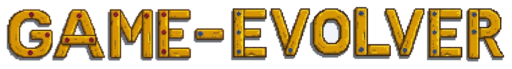

<p align="center">
  
</p>

<h1 align="center">game-evolver</h1>

<p align="center">
  <strong>Two-timescale harness evolution for game-generation agents.</strong><br/>
  Evolve how agents build games, verify what they produce, and reuse successful harness elements across benchmarks.
</p>

<p align="center">
  <a href="#-benchmarks">Benchmarks</a> ·
  <a href="#-quick-start">Quick Start</a> ·
  <a href="#-linux-quick-deploy">Linux Deploy</a> ·
  <a href="#-nested-evolution">Nested Evolution</a>
</p>

---

## ✨ What Is game-evolver?

`game-evolver` is a research codebase for improving game-generation agents through harness evolution. Instead of treating an agent prompt, tool policy, evaluator, and recovery procedure as fixed scaffolding, the system represents them as a harness that can be revised, tested, and accepted only when it improves benchmark behavior.

The framework runs on two timescales. The inner loop optimizes the harness used by a game-generation agent on concrete tasks, while the outer loop manages the reusable harness-element library that future inner-loop runs draw from. This makes the project useful both for studying game-making agents and for stress-testing harness design across broader coding benchmarks.

### 🧱 Core Ideas

| Icon | Component | Role |
|---|---|---|
| 🎮 | Game-generation backbone | Produces playable projects or code artifacts from benchmark tasks. |
| 🧪 | Harness evolution | Mutates prompts, roles, tools, repair flows, and verification routines around the backbone. |
| ✅ | Dual rubric verification | Uses hard constraints and aggregated soft scores to decide whether a candidate harness is accepted. |
| 📚 | Element library | Tracks harness elements, their usage, and their empirical success so later runs can reuse better building blocks. |
| 🔁 | Nested loops | Connects per-task inner-loop optimization with slower outer-loop maintenance of the harness library. |

---

## 🎮 Benchmarks

The repository currently connects game-focused benchmarks and general coding benchmarks through benchmark-specific adapters. Game benchmarks emphasize playable artifacts, engine constraints, and evaluator feedback, while general benchmarks make it possible to test whether the same harness machinery transfers beyond games.

| Benchmark | Type | Path | What It Covers | Notes |
|---|---|---|---|---|
| 🎲 GameCraftBench | Game | `gcbench/` | Open-ended game construction tasks | Pinned checkout of [GameCraftBench](https://github.com/FreedomIntelligence/gamecraft-bench). |
| 🕹️ GameDevBench | Game | `third_party/gamedevbench/` | Project-level game development tasks | Symlinked as `gdbench/`; task archives are kept outside git. |
| 🌌 VGameGym | Game | `game-loop/third_party/SKYLENAGE-GameCodeGym/` | GameCodeGym-style game generation and evaluation | Dataset download is handled by `scripts/download_vgamegym_dataset.py`. |
| 🧩 VeriGame / GameGen-Verifier | Game | `game-loop/third_party/GameGen-Verifier/` | Verification-oriented game generation | Bridges public verifier tooling into the game-evolver runner. |
| 🧱 TinyMMO | Game | `game-loop/experiments/tinymmo/` | Lightweight Godot MMO scenarios | Includes deterministic evaluators and boss/HUD task variants. |
| 🏗️ NL2RepoBench | General | `game-loop/third_party/NL2RepoBench/` | Natural-language-to-repository generation | Used for Linux worker experiments; official tasks are not tracked. |
| 🧰 SWE-bench-style configs | General | `game-loop/experiments/configs-v4/` | Repository repair and coding workflows | Configured through the same runner and runtime stack. |
| 💻 TerminalBench / TauBench / WeaveBench | General | `game-loop/experiments/configs-v4/` | Tool-use, terminal, and agent workflow evaluation | Included to probe transfer of harness choices beyond game-only settings. |

---

## 🧭 Repository Map

| Path | Purpose |
|---|---|
| `game-loop/` | Main Python package: runners, benchmark adapters, runtime bridges, nested evolution logic, and tests. |
| `game-loop/game_loop/` | Importable package with benchmark abstractions, runtime integration, and evolution modules. |
| `game-loop/experiments/configs-v4/` | Main experiment configuration set for game and general benchmarks. |
| `game-loop/experiments/general-baseline/` | Seeds and baseline artifacts for general-benchmark runs such as NL2Repo. |
| `game-loop/experiments/tinymmo/` | TinyMMO task definitions, baseline evaluations, and benchmark metadata. |
| `gcbench/` | Pinned GameCraftBench checkout. |
| `third_party/OpenGame/` | OpenGame SDK; build it with `npm ci && npm run build`. |
| `third_party/gamedevbench/` | GameDevBench source checkout. |
| `docs/ge.png` | README title image. |

---

## ⚡ Quick Start

```bash
cd game-loop

# Build the OpenGame SDK used by game adapters.
cd ../third_party/OpenGame
npm ci
npm run build
cd ../../game-loop

# Create the Python environment.
python3.11 -m venv .venv
source .venv/bin/activate
python -m pip install --upgrade pip wheel
python -m pip install -e .

# Prepare optional benchmark assets.
bash scripts/gcbench_e2e/setup_local.sh
python3 scripts/download_vgamegym_dataset.py

# Configure local runtime secrets outside git, then set the game engine bridge.
export GODOT_EXEC_PATH="$PWD/scripts/gdbench_e2e/godot_docker.sh"

# Check the runner and available experiment queues.
PYTHONPATH=. python3 scripts/run_new_bench_experiments.py --dry-run
```

Generated artifacts, logs, local datasets, diagnostics, and credentials should stay out of git. The `.gitignore` covers local checks and experiment run directories.

---

## 🐧 Linux Quick Deploy

This path is intended for Linux workers that need to pull the repository, connect the environment, and run `nl2repo` experiments quickly.

### 1. Clone and create the Python environment

```bash
git clone <game-evolver-repo-url> game-evolver
cd game-evolver
git submodule update --init --recursive

cd game-loop
python3.11 -m venv .venv
source .venv/bin/activate
python -m pip install --upgrade pip wheel
python -m pip install -e .
```

The Python package requires Python `>=3.11`. If the worker image only has an older interpreter, install Python 3.11 first and recreate the virtual environment.

### 2. Install system dependencies

`nl2repo` uses Docker to run official project evaluators, so the worker must have a working Docker daemon and enough disk space for benchmark images.

```bash
docker info
python - <<'PY'
import sys
print(sys.version)
PY
```

Mutable run state is written under `game-loop/experiments/`. Run commands from `game-loop/`, not from a read-only third-party checkout.

### 3. Put NL2RepoBench in the expected location

`NL2RepoBench` is not tracked by this repository. The bridge expects official tasks at:

```text
game-loop/third_party/NL2RepoBench/NL2RepoBench_src/test_files/
```

On a Linux worker, either copy a verified checkout to that path or clone the source mirror used by the project and check out the verified revision:

```bash
mkdir -p third_party
git clone https://github.com/EnvCommons/NL2RepoBench.git third_party/NL2RepoBench
cd third_party/NL2RepoBench
git checkout 61d26cc0abd084ece8f5d805dcbd3f806a291f15
cd ../../

test -d third_party/NL2RepoBench/NL2RepoBench_src/test_files
test -f experiments/general-baseline/seed_nl2repo/start.md
```

If the directory is copied from another machine, preserve each task's `start.md`, `test_commands.json`, `test_files.json`, and `test_case_count.txt`.

### 4. Rewrite local absolute paths in nl2repo configs

The checked-in `nl2repo-L4_*.json` files can contain the original development-machine path. Rewrite `benchmark.options.root` to the worker's local `game-loop` directory before launch:

```bash
python - <<'PY'
import json
from pathlib import Path

root = Path.cwd().resolve()
for path in Path("experiments/configs-v4").glob("nl2repo-L4*.json"):
    value = json.loads(path.read_text(encoding="utf-8"))
    value.setdefault("benchmark", {}).setdefault("options", {})["root"] = str(root)
    path.write_text(json.dumps(value, indent=2, ensure_ascii=False) + "\n", encoding="utf-8")
    print("updated", path)
PY
```

### 5. Configure private runtime access

The queue runner loads `game-loop/.env.local` when the file exists. Keep credentials, private endpoints, and model-routing details in that local file or in the worker environment. The public README intentionally does not list provider endpoints or secret variable names.

```bash
# Optional progress log location.
export GENERAL_BENCH_PROGRESS_FILE="$PWD/experiments/general-baseline-runs/progress.txt"
```

Do not commit `.env.local` or experiment output directories.

### 6. Check and launch nl2repo

From `game-loop/`:

```bash
source .venv/bin/activate
export PYTHONPATH="$PWD"

# Show discovered tasks and available queues.
python scripts/run_new_bench_experiments.py --dry-run

# Run one NL2Repo queue shown by --dry-run.
python -u scripts/run_new_bench_experiments.py --queue <nl2repo-queue-name>
```

Use `--dry-run` as the source of truth for queue names on the worker. Private provider names and endpoint details should stay in local configs rather than in the public README.

Outputs are written under:

```text
game-loop/experiments/general-baseline-runs/new_bench_<runtime>_nl2repo-resume-*/
```

Each case has a per-task log and, once the bridge reaches official evaluation, an `nl2repo_execution.json` manifest under the candidate directory. A quick health check is:

```bash
find experiments/general-baseline-runs -path '*nl2repo_execution.json' | tail
```

If Docker is missing, the official NL2Repo evaluator fails as infrastructure rather than as a benchmark score. If no tasks are discovered, check `third_party/NL2RepoBench/NL2RepoBench_src/test_files`.

## 🔁 Nested Evolution

game-evolver exposes a nested evolution workflow for experiments that need both per-task harness improvement and slower harness-library maintenance. In a typical run, the inner loop proposes a candidate harness, executes benchmark tasks, verifies hard and soft rubric changes, and accepts only candidates that do not regress hard constraints while meeting the configured aggregate soft-rubric rule. The outer loop is opt-in and updates the harness-element library from accumulated evidence such as element usage, success rate, and downstream acceptance behavior.

```bash
PYTHONPATH=. python3 -m game_loop agentx-nested-init \
  --run-dir /tmp/game-evolver-run \
  --config experiments/configs-v4/<benchmark-runtime-config>.json

PYTHONPATH=. python3 -m game_loop agentx-nested-epoch \
  --run-dir /tmp/game-evolver-run \
  --config experiments/configs-v4/<benchmark-runtime-config>.json \
  --epoch 1 \
  --task-source /path/to/task \
  --seed-artifact /path/to/seed
```

The current CLI subcommand names keep historical compatibility, but the project-level method and documentation use the `game-evolver` name.
