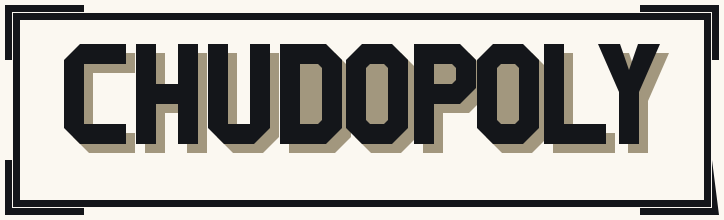
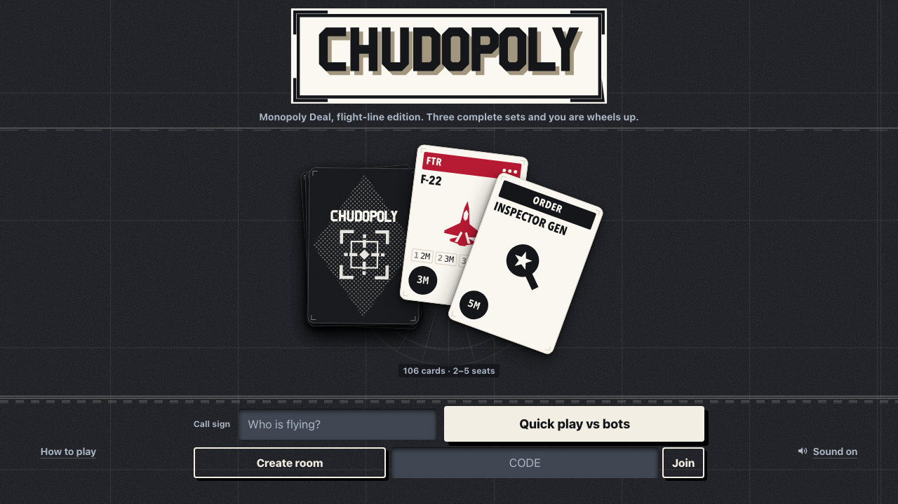
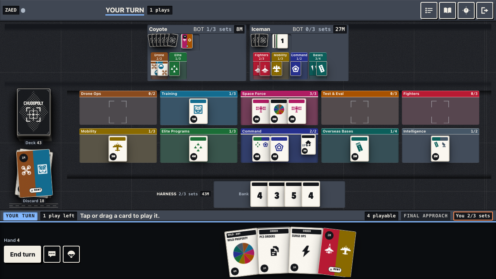
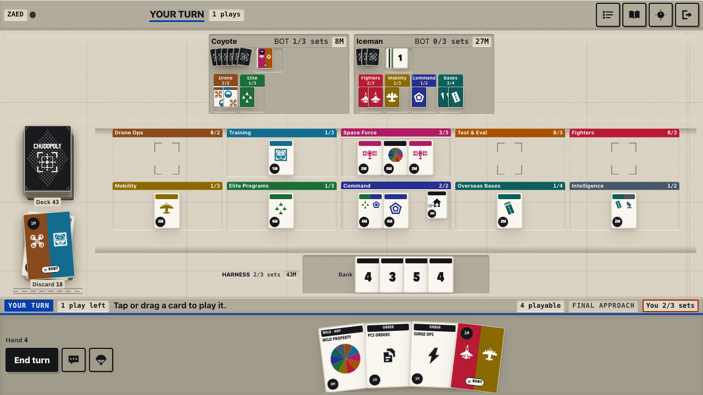

<p align="center">
  
</p>

<p align="center">
  <a href="https://chudopoly.deal"><strong>chudopoly.deal</strong></a> ·
  <a href="ARCHITECTURE.md">Architecture</a> ·
  <a href="ART-DIRECTION.md">Art direction</a> ·
  <a href="BOT-STRATEGY.md">Bot strategy</a>
</p>

---

Chudopoly is a real-time multiplayer card game for 2–5 players — a Monopoly Deal variant with
US Air Force theming, played in the browser with no install and no account. Private room codes,
five bot personalities that take over when someone drops, turn and response timers, chat, and a
table that works the same on a phone as on a desktop. The server is authoritative; the client
renders and asks permission.

It is also, deliberately, an odd piece of engineering. There is no build step, the client draws
every card and icon in code rather than shipping images, and a seventeen-stage gate chain has to
go green before anything lands. If that is the part you came for, skip to
[what's unusual about it](#whats-unusual-about-it).

<p align="center">
  
</p>

## Run it

Requires Node.js 20–24. Two runtime dependencies, `express` and `ws`.

```sh
npm ci
npm start
```

Open `http://localhost:3000` and hit **Quick play vs bots**, or create a room and share the
invite link. There is nothing to compile and nothing to watch — `npm start` is the entire
deployment story.

## What's unusual about it

**No build step, and it is load-bearing.** The client is native ES modules served straight off
disk: 56 files under `public/src/`, one `<script type="module" src="/src/main.js?v=1">` entry,
real `import` statements below it. No bundler, no transpiler, no config file for either. What
you read in `public/src/` is byte-for-byte what the browser runs, which makes a stack trace a
real address and a git blame the whole story. It costs roughly 550 KiB gzipped for the client
(1.5 MB raw), which is more than a bundler would produce and is the price being paid on purpose.

**The client ships essentially no binary assets.** Every card face, card back, set glyph, icon,
texture and animation is generated in code — CSS, canvas, and SVG authored as text. The only
binaries anywhere under `public/` are eight `.opus` music tracks (8.8 MiB, none of it fetched
before first paint) and six PWA install icons (24 KiB) that are themselves rendered by a
checked-in generator from the game's drawn geometry — regeneration is byte-for-byte reproducible
and gated. Nothing the in-game client displays is a raster file. This is enforced, not merely
intended: `tools/checkAssets.mjs` walks the tree on every verify run, checks extensions, sniffs
magic bytes, catches base64 data-URIs hiding in source, and fails on anything outside a
three-entry allowlist. Every sound *effect* is synthesised at play time, which is also why a
click heard 400 times a match does not turn into a woodpecker — pitch and timing jitter per call.

**A structured event channel drives everything you see and hear.** The engine appends typed
events to the game state as it mutates (`{seq, t, ...payload}` — 35 event types today), and the
broadcast carries the tail. The client animates only unseen events, in order, then reconciles the
DOM against the state snapshot. The snapshot is always truth; animation is only presentation, and
a `driftCount` of anything but zero fails the playtest gate. Nothing dispatches off log prose —
every card that moves, every sound that fires, and every haptic traces to an event id. Redaction
is part of the contract: events must leak nothing the per-player view hides, so a draw carries
card ids only in the drawer's own copy and `{count}` in everyone else's.

**Cards are objects, not markup.** Every card on screen is a persistent DOM node keyed by
`data-card-id`, and it moves between zones by reparenting plus a FLIP transform. Rebuilding a
zone with `innerHTML` is banned outright and scanned for, because it would kill the animation,
the scroll position and the focus ring in one move.

**Balance came out of simulation, not vibes.** `simulate.js` runs bot-only games with the network
layer bypassed, which makes ten thousand games cheap. The five personalities — random,
conservative, neutral, aggressive, chud — currently sit at 13.3% / 26.1% / 33.6% / 38.2% / 13.8%
in mixed four-player games, inside the 8–60% band the architecture requires, with first-player
advantage at 23.1% against a 25.0% fair share (10,000 games, all decided). The starting point was
a two-horse race: aggressive won 55%, chud won 0 of 100. `tools/simbalance.mjs` is wired into the
gate chain and fails the build if any personality leaves the band.
[BOT-STRATEGY.md](BOT-STRATEGY.md) is the long version, including the tuning that did not work.

**Seventeen gates, and a rule about gates.** `npm run verify` chains `check → test → checkAssets
→ checkClient → checkServer → statsfuzz → simbalance → playtest → tabaway → handoff → touchtest →
dragtest → screenshot → checkContrast → coverage → grayscale → audiotest`. Strict is the default: a *skipped* gate fails the run,
because a chain that quietly drops a link is the same failure with fewer steps. Beyond the usual
suspects, these assert things that are awkward to assert — real CDP touch events (synthetic
pointer events never consult `touch-action`), text contrast measured from the rendered frame
rather than from CSS, a grayscale tonal-hierarchy floor in CIE L\*, peak levels and cue ordering
in an `OfflineAudioContext`, and a review screenshot set gated on *its own honesty*: two
differently-named shots that hash identically are a failure, because that is what happens when a
client-side mode never actually got driven.

The house rule is the interesting part: **a gate must be proven to fail.** Before an assertion is
trusted, the fix it guards gets broken deliberately and the gate has to go red — several tools
carry a `--prove` flag that does exactly that. An assertion nobody has watched fail is a
decoration. The corollary, learned the hard way more than once, is that a summary may not report
success over a set it did not fully measure; one run printed "✓ tap targets ≥ 44px on all 9
measured surfaces" while all five staged surfaces had failed to load.

**The table changes between themes; the cards do not.** Light is an airfield apron in daylight,
dark is the same apron at night, and the cards stay cream printed stock in both — like real cards
in a lit room and a dark room. Colour and material are kept as two independent channels: card
sets own colour, interface signals own material, so ten set hues and four semantic hues never
have to share a 360° circle.

<p align="center">
  
  
</p>
<p align="center"><em>The same game state, both themes. The apron changes; the stock does not.</em></p>

## The rules are not quite Monopoly Deal

Three complete sets wins, but reaching three does not end the game on the spot — it arms **final
approach**, and every other player gets one turn to break the set before the win resolves. That
is ours. Monopoly Deal ends the game where the third set lands on your own turn, and makes you
wait only for a set handed to you during somebody else's turn.

The deck is 106 cards by default and a custom lobby can edit thirteen of the counts, clamped and
resolved server-side. Four presets ship, including `mdFaithful`, which lands on Monopoly Deal's
category-for-category composition **and now on its win too** — own-turn wins resolve on the spot,
rainbow wilds cannot finish a set alone, and an OPSEC played on your own turn costs one of your
three plays, as the modern printings charge it. Rulings that depart from the source, and the
measurements or research that produced them, are recorded in
[ARCHITECTURE.md §3](ARCHITECTURE.md) — including the ones where we knowingly took the minority
position.

## Repo map

| Path | What lives there |
|---|---|
| `game.js` | The engine — rules, deck, state, the event channel. Pure, seedable, no network. |
| `bot.js`, `simulate.js` | Bot decision-making and the headless simulation harness. |
| `server.js`, `server/` | Express + `ws`, protocol validation, timers, reconnect, per-player redaction. |
| `public/src/` | The client: `core/ net/ state/ table/ anim/ interact/ ui/ audio/ fx/`. |
| `public/style/` | Design system CSS. One file holds literal colours; the rest read tokens. |
| `test/` | 479 cases across 33 files, `node:test`, no framework. |
| `tools/` | The gate chain, plus the Playwright harness and fixture recorder. |
| `docs/` | Brand assets for this README. Nothing here is served to a player. |

## Documentation

- **[ARCHITECTURE.md](ARCHITECTURE.md)** — the binding constitution. Non-negotiables, directory
  ownership, the event vocabulary, the gate table, and a running log of hard-won invariants with
  the incident that earned each one.
- **[ART-DIRECTION.md](ART-DIRECTION.md)** — "APRON": the ratified visual identity, measured
  colour tokens with their real contrast ratios, and the reasoning behind colour-versus-material.
- **[BOT-STRATEGY.md](BOT-STRATEGY.md)** — how the AI was built, from a 0%-win personality to a
  balanced field, with the simulation data at each step.

Both of the first two are law for anyone working in this repo, and they are written to be argued
with: push back with measurements, not opinions.

## Configuration

Copy `.env.example` into your host's environment settings. `GIPHY_KEY` is optional. Same-origin
WebSockets are accepted automatically in production; `ALLOWED_ORIGINS` adds explicitly trusted
origins.

Rooms live in process memory, so run a single instance unless that state is moved to shared
storage — a restart or a deploy ends active matches. `GET /health` answers readiness checks.

## Status, honestly

This is a personal project in the middle of a large revamp, not a finished product, and a few
things are worth saying plainly rather than leaving to be discovered:

- The full `npm run verify` chain is the real bar; `npm test` and `npm run check` alone are the
  inner loop. Several gates need Playwright and a few minutes.
- The architecture document has drifted from the code in places — it documents 24 event types
  where the engine emits 35, and parts of its audio prose describe five match beds where four
  shipped. The code is the truth where they disagree.
- The screenshots above are generated by the harness, not hand-cropped:
  `npm run tool:screenshot` writes the full review set to `tools/shots/`, and the three images in
  `docs/` are `home@desktop`, `mid-game@desktop` and `mid-game@desktop-light` copied from it.
  Regenerating them is a one-liner, which is the point.
- The ship gate defined in ARCHITECTURE §11 was passed on 2026-08-07 — the honest assessment
  below carries the real numbers.

## Honest assessment

ARCHITECTURE §11's ship gate: independent critic agents score Look, Feel/Juice, Mobile UX,
Clarity/Rules and Robustness 1–10 with cited evidence, fresh critics every round, ship at ≥8 on
every axis. Three rounds were run on 2026-08-07, with fix waves between them and a rule that no
critic is ever reused and no fixer scores its own work. A score without evidence the critic
generated themselves — screenshots they rendered and viewed, gates they ran, measurements they
made — was void.

| Axis | Round 1 | Round 2 | Round 3 (final) |
|---|---|---|---|
| Look | 7 | 8 | **8** |
| Feel / Juice | 7 | 9 | **8** |
| Mobile UX | 7 | 8 | **8.5** |
| Clarity / Rules | 7 | 9 | **8** |
| Robustness | 7 | 6 | **9** |

The round-2 Robustness 6 was real at the time — an intermittently red tab-away gate with a
suspected table wedge under it — and its resolution is worth stating plainly: the server was
never wedged. The gate's own synthetic input could not deliver a tap in a forced-discard path it
had never staged, and it declared a live table dead roughly one run in three. The gate was fixed
to drive the real input pipeline, and the server still gained a proven watchdog for the one
state a zero-timer bot room genuinely cannot recover from, because the class of bug is real even
though this instance was not.

The final round scored a build with all seventeen gates green. The five findings the critics
left standing between 8 and higher are **all closed as of the 2026-08-08 overnight audit**:
the pick-open steal fan now flies open as motion (fixed in 263961b, re-verified with frame
strips — 20 moving frames over 181ms, max single-frame step 16%); the modal scroll-edge
mid-line crops were fixed in 263961b (re-verified: text crossing a fold fades over ~22 device
px, pixel-measured); the Goal page drops the CHUD bullet on decks without it (re-verified on a
chud:0 deck); the banked-card peek names the owner's board, not the viewer's (re-verified on a
staged mid-game); and the per-IP caps now key on the rightmost trusted `X-Forwarded-For` hop
(`CHUD_TRUST_PROXY_HOPS`, fixed in the audit — 8/8 spoofed sockets were admitted before, 4/8
after). That audit also fixed three things the critics never saw: the Mission Log wiped itself
on any reload past event 120; the lobby's deck steppers and sudden-death radios were dead
controls whose choices never reached the wire; and the touch gate's 40-second turn wait
predated shuffled seats, so it failed whenever the human wasn't first. What no critic
could verify in this environment, stated rather than hidden: how the music and haptics actually
feel on a real device (headless measurement only — and this project has already had one metric
call a bed "best" that the owner rejected by ear), real iOS Safari safe-areas and soft keyboard,
and true mid-phone frame rate beyond a 4×-throttled proxy.

## Contributing

Issues and pull requests are welcome, with one warning: `ARCHITECTURE.md` genuinely is binding,
and a change that violates §0 will be sent back regardless of how well it works. Read it first —
it is short, and it explains itself.

## Licence and attribution

Chudopoly is an original game that borrows its core mechanics from Hasbro's **Monopoly Deal**.
Game mechanics are not copyrightable, and every card name, card face, glyph, and piece of art in
this repository is original work. *Monopoly* and *Monopoly Deal* are trademarks of Hasbro, Inc.
This project is not affiliated with, endorsed by, or sponsored by Hasbro; the references above
are descriptive, to say plainly what kind of game this is.

See [LICENSE](LICENSE) for terms — plain MIT — and [TRADEMARKS.md](TRADEMARKS.md) for the
trademark position, which the licence grants no rights in.
