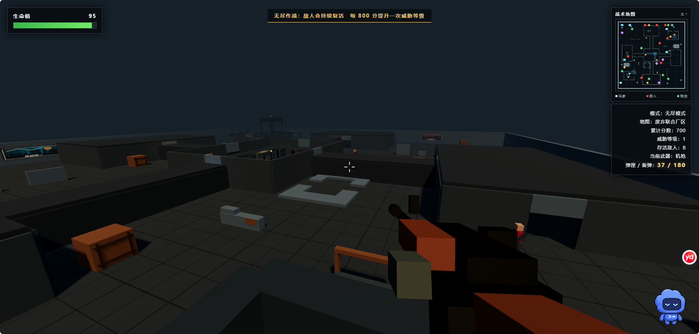

# 钢铁突围（Iron Breakout FPS）

一款使用 Three.js 制作的浏览器第一人称射击游戏。除 Three.js CDN 外，地图、角色、武器、墙画、特效和界面全部由 HTML、CSS、JavaScript 与程序几何体生成，不需要额外图片或模型素材。

## 游戏实机画面



> 从高层狙击塔俯瞰“废弃联合厂区”，右上角战术地图会实时显示玩家、敌人与补给位置。

## 游戏特色

- 无尽模式：5 张不同拓扑地图，敌人持续复活，难度随累计分数提升。
- 关卡模式：5 个逐步提升难度的关卡，每关需要消灭 25 名敌人。
- 武器系统：机枪、手枪、狙击枪、匕首和火箭发射器。
- 弹药系统：独立弹匣与备弹、手动或自动换弹、随机弹药补给；换弹时准星下方的提示框内进度条与倒计时秒数同步填充（共用同一计时数据源，真·暂停时一并冻结），切枪、拾取弹药包或重开时自动清除。
- 换弹提示：弹药进入决策区间时，准星下方会给出与状态对应的提示——弹匣低于 25%（与右侧读数低弹匣脉冲同阈值）建议按 R 换弹；弹匣打空但备弹尚存时提示按 R 立即换弹；弹匣与备弹同时耗尽则红色脉冲指引寻找蓝色弹药包。提示与右侧弹药读数共用同一数据源，换弹进行中让位给换弹框，切枪、拾取、重开与暂停语义全部随同源入口复位。
- 空仓干火反馈：弹匣为空时扣扳机（含自动换弹进行中连扣）会响一声空膛机械双响，第一人称枪身同时做小于实弹后坐的小幅点动，让玩家明确感知“扳机已扣下但未发射”；按住扳机按 0.16 秒节奏门限触发，防连扣刷屏；无备弹时与“弹药耗尽”播报、红色准星提示共存；真·暂停 / 结算 / 菜单下不触发。
- 敌人 AI：全地图连通巡逻、限时追击、视线检测、持枪射击与近距离伤害。
- 复杂工业地图：房间、回廊、高架、梯子、暗道、台阶、掩体和高层狙击塔。
- 高空交战：每张地图设置狙击塔，玩家可以攀爬占领，塔顶也可能出现一名敌方狙击手。
- 补给系统：回血包、弹药包、随机武器物资包会不定期刷新；HUD 会倒数下一补给的类型与抵达倒计时（临近 5 秒金色警示），投放时战斗信息流实时播报。
- 补给指引：弹药耗尽（弹匣与备弹同时为空，与换弹提示“备弹耗尽”同口径）时，屏幕边缘出现一枚青色菱形箭头指向最近的蓝色弹药包；生命值危急（与红色濒死横幅同阈值触发/解除）时出现一枚绿色十字箭头指向最近的血包，箭头旁标注实际距离。颜色与小地图战术图标一致（青=弹药包、绿=血包），与红色威胁箭头形状颜色明确区分，两种指引可同屏共存；0.2 秒游戏时基刷新，指向最近同类补给，补给被拾取后熄灭或改指次近目标，地图上无该类型补给时箭头熄灭；纯反馈层，不参与命中判定、伤害与计分；真·暂停随帧冻结并在暂停瞬间熄灭、恢复后按当前补给数据源重新点亮，死亡、重开与返回菜单时立即清除，无旧方向残留。
- HUD：生命值、弹药、任务信息、小地图、命中与受伤反馈。
- 连杀系统：4.5 秒内连续击杀可叠加伤害加成（最高 +100%），中断或换弹结算保底奖励；HUD“连杀加成”下方的窗口倒计时条实时显示 4.5 秒判定窗口剩余时间（临近 1 秒金色警示脉冲，配色随连杀层级变化），中断即结算；左下角战斗信息流实时播报残血目标、连杀与结算。
- 受击方向指示：任何血量下被击中后，屏幕边缘会出现一段橙色弧线，指向伤害来源在命中瞬间的方位（枪弹与近战均生效），停留约 1.4 秒后淡出；与低血量威胁箭头（红色三角 + 距离）形状、颜色不同，不会混淆。死亡、重开与返回菜单时立即清除。
- 受击伤害数值：被敌人枪弹或近战命中时，屏幕中下方（准星下方，视口高度 63.5% 处，水平 ±90px 随机散布避免多枚重叠）会瞬间浮现一枚红色数值（如 `-8`），显示当前聚合窗口内实际受到的伤害；数值上浮 46px、0.85 秒内淡出。近战是逐帧连续伤害，故按 0.35 秒窗口聚合：窗口累计 ≥ 1 才生成一枚（数值为窗口内真实伤害之和、四舍五入），每窗口至多一枚，不足 1 不出现，不刷屏也不漏显。与伤害数字（锚定敌人世界坐标）不同，受击数值锚定屏幕本身，盲区方向受到的伤害同样可见、不会飘到屏幕外。纯反馈层：不参与命中判定、伤害、计分与连杀结算；由主循环逐帧驱动，真·暂停时在半空冻结（既不推进也不淡出），死亡当帧、过关结算、重开与返回菜单时立即清除，无旧数值残留。
- 敌人受击与死亡反馈：敌人被击中时全身瞬时闪白（0.18 秒衰减），每个敌人使用独立克隆材质，闪光不会扩散到其他敌人；敌人死亡时播放橙色火花爆裂并定格 0.24 秒缩小，替代此前的“死亡瞬间消失”。纯视觉层，击杀计分、分数、小地图与重生结算均在死亡当帧照常结算。
- 敌人血条：敌人血量首次低于满值时，头顶出现一条常驻血条，填充宽度随剩余血量收缩、颜色由绿渐红，满血隐藏、死亡当帧熄灭，便于判断残血目标还需补几枪；纯视觉层，不进入命中判定，真·暂停与死亡动画清理路径均无残留。- 敌人开火空间化音效：敌人开火时，枪声按其在玩家视野中的方位做立体声像（左/右听声辨位），距离越远音量越低、音色越暗（46 米外完全听不见）；塔顶狙击手按狙击枪音色，其余敌人按机枪音色，与玩家自己的枪声同源音色表。纯反馈层：不参与命中判定、伤害与计分，真·暂停 / 结算 / 菜单下随 AI 一并冻结，不触发。
- 敌人枪口曳光：敌人每次开火（命中或偏射）都会从枪口到弹着点画一条橙色细光束——命中时终点停在视点前 0.35 米（不穿进视线）、打墙时终点落在墙面火花处、未打中任何表面时按完整射距画到射线尽头；0.13 秒内亮起、最后 0.05 秒快速淡出，与空间化枪声（听声辨位）、受击方向弧线（受击后的方位提示）互补，“哪一枪从哪个方向来、打在哪”一眼可读。纯反馈层：不参与命中判定、伤害与计分，真·暂停随帧冻结，死亡当帧、开局 / 过关 / 返回菜单时统一清除，无跨局残留。
- 击杀得分漂浮：击杀敌人时击杀点立即浮现一枚白色“+得分”数值（如 `+100`），爆头击杀为金色 `+100 爆头`（与击杀播报爆头徽章同色）；数值与 `killEnemy` 本帧写入累计分数的 `killScore`（100 × 当前威胁等级）完全同源，也与左上角击杀播报条目的得分同源，得分来源一眼可读。1.05 秒内上浮淡出，锚点在胸口高度，与头顶红色伤害数字不叠压。纯反馈层：不参与命中判定、伤害、计分与连杀结算；由主循环逐帧驱动，真·暂停时在半空冻结，返回菜单立即清除，其余状态按 TTL 自然淡出，无旧数值残留。

- 击杀播报：左上角逐次播报每次击杀的武器、得分与爆头徽章；得分与右侧累计分数同源（100 × 当前威胁等级），爆头击杀带金色徽章，最新一条置顶、最多 5 条、约 4 秒后淡出；武器取致死一击来源（火箭弹等延迟命中按发射时武器记录，不随切枪漂移）；纯视觉层，真·暂停同步冻结，死亡、重开与返回菜单时整列清除。
- 存活时间：右侧信息面板与累计分数同列实时显示 `m:ss`，主循环按有效战斗帧累加（真·暂停、结算与菜单不计入），关卡模式与累计分数同口径跨关累计；死亡结算与过关结算都会给出终局存活时长。
- 最佳分数：自动保存在本地存储，主界面 HUD 与结算界面都会显示历史最佳。
- 真·暂停：Esc 暂停期间敌人重生、补给投放、换弹、连杀计时与倒计时读数全部冻结，恢复时增援计时按暂停时长补偿，不在暂停期间隐形推进或恢复瞬间集中刷怪。
- 准星目标距离读数：十字线射线命中活体敌人时，准星下方显示到命中点的实际距离（如 `13.7 m`），按距离带分色（≤20 米绿 / 20–45 米金 / >45 米红），开火前即可读出提前量与命中难度，狙击镜（Q）下准星隐藏时仍可见；12.5 Hz 游戏时基射线驱动（成本与一发命中扫描同量级），墙体遮挡或指向空地时熄灭；纯反馈层，不参与命中判定、伤害与计分；真·暂停随帧冻结并熄灭，死亡、重开与返回菜单时经同一 `clearTargetRange()` 路径立即清除，无旧距离残留。

## 操作方式

| 操作 | 按键 |
| --- | --- |
| 移动 | W / A / S / D |
| 瞄准视角 | 鼠标 |
| 射击 | 鼠标左键 |
| 快速切换武器 | 1 机枪 · 2 手枪 · 3 狙击枪 · 4 匕首 · 5 火箭弹 |
| 狙击镜 | 按住 Q |
| 换弹 | R（弹匣打空时按 E 可立即换弹） |
| 跳跃或攀爬 | 空格 |
| 奔跑 | 左 Shift |
| 暂停/释放鼠标 | Esc |
| 结算界面返回菜单 | Esc |

## 运行游戏

下载仓库后直接双击 `index.html`，或使用任意静态文件服务器打开。首次加载需要联网获取 Three.js CDN 脚本。

## 项目结构

```text
iron-breakout-fps/
├─ index.html          # 页面结构与源码加载入口
├─ css/
│  └─ game.css         # HUD、菜单、瞄准镜和响应式界面样式
└─ js/
   ├─ core.js          # 渲染环境、游戏状态、碰撞、地图基础组件
   ├─ maps.js          # 五张无尽地图与五个关卡地图
   ├─ weapons.js       # 武器、弹药、换弹和随机补给
   ├─ enemies.js       # 敌人模型、生成、巡逻、追击与射击 AI
   ├─ combat.js        # 射击、弹道、命中特效、玩家生命与移动
   └─ main.js          # 模式流程、输入事件和游戏主循环
```

## 技术栈

- HTML5 / CSS3 / JavaScript
- [Three.js](https://threejs.org/)
- Canvas 程序化纹理

## 许可证

本项目采用 [MIT License](LICENSE) 开源。
