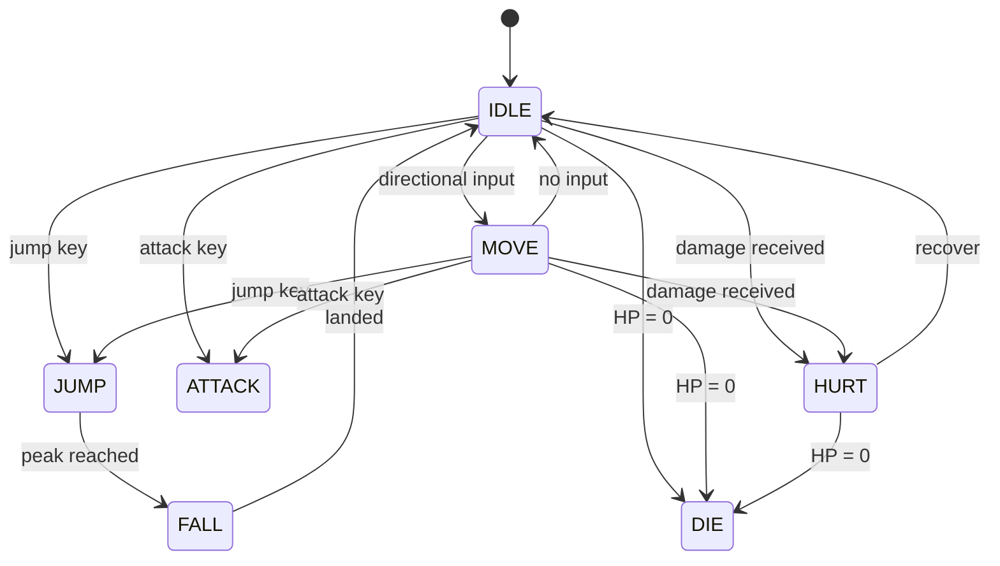
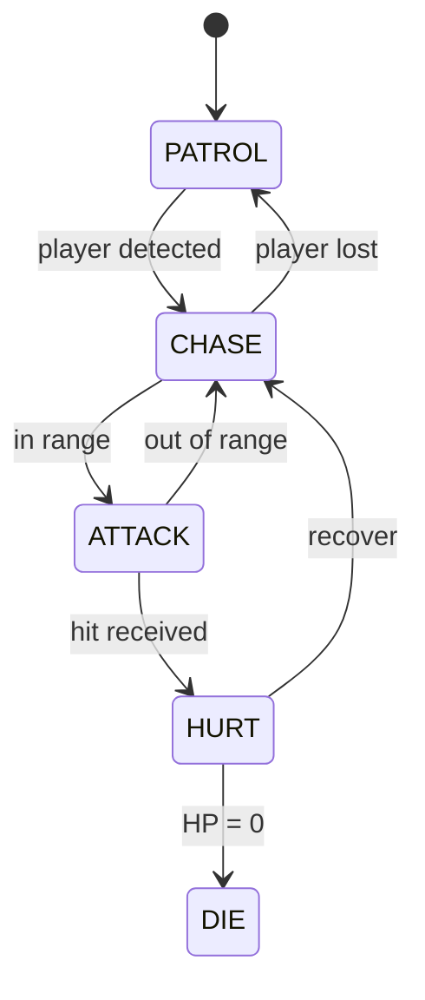

# State Machines

> **Owner**: Designer (initial states from GDD), Architect (adds states when planning new mechanics)
> One section per character type. Add enemy sections as they are designed.

---

## Player

<!-- TODO: Update states based on GDD.md character design.
Default states are a starting point — add/remove based on your game's mechanics. -->

**States**: `IDLE`, `MOVE`, `JUMP`, `FALL`, `ATTACK`, `HURT`, `DIE`

---

## Enemies

<!-- Add one section per enemy type as they are designed in GDD.md -->

<!-- Example:
### Grunt

**States**: `PATROL`, `CHASE`, `ATTACK`, `HURT`, `DIE`

-->
