

  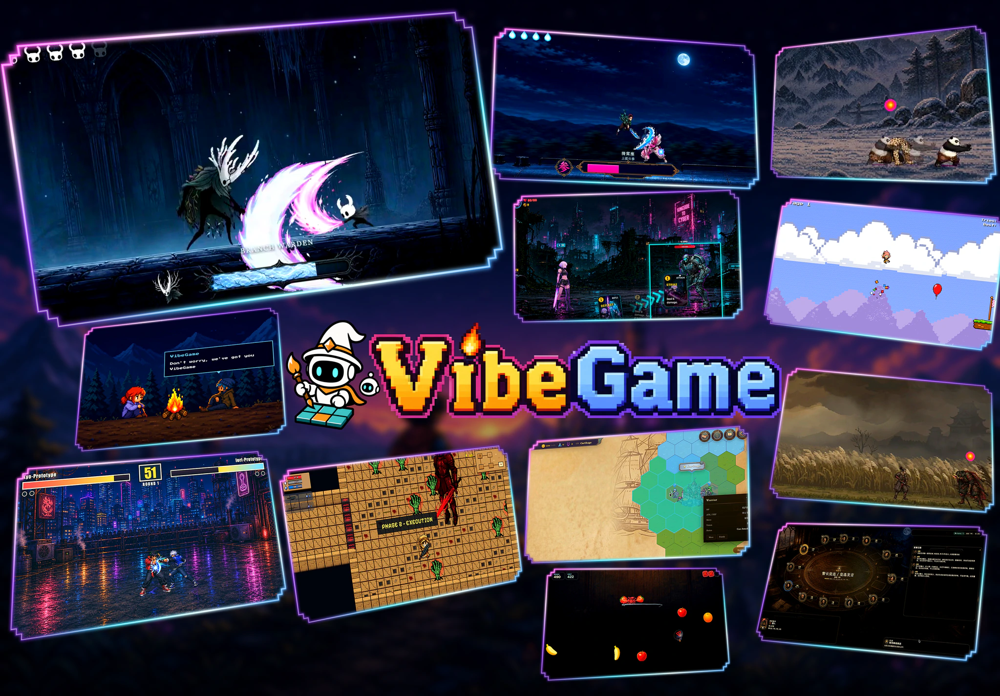
  

    
    
    
    
    
  

  

    <a href="https://vibegame.tettet.org"><strong>Project Page</strong></a>
    &nbsp;·&nbsp;
    <a href="https://vibegame.tettet.org/#demos"><strong>Watch Demos</strong></a>
    &nbsp;·&nbsp;
    <a href="./technical_report.pdf"><strong>Technical Report</strong></a>
    &nbsp;·&nbsp;
    <a href="https://discord.gg/Ec6d9wx8sU"><strong>Discord</strong></a>
    &nbsp;·&nbsp;
    <a href="assets/wechat-group.png"><strong>WeChat Group</strong></a>
  

  
<strong>VibeGame: Vibe Your Dream Game</strong>

## News

- **[2026.08]** 🚀 We release VibeGame: Prompt-to-Game Development with AI-Native Engine and Self-Evolving Adversarial Agent Team! Check our [Project Page](https://vibegame.tettet.org) and [Technical Report](./technical_report.pdf)

## Demos

Watch the demos and explore more project details on the [Project Page](https://vibegame.tettet.org/#demos).

<table>
  <tr>
    <td width="33%" align="center" valign="top"><a href="https://vibegame.tettet.org/#demos">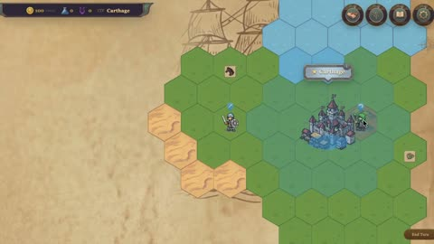</a> <strong>Civilization prototype</strong></td>
    <td width="33%" align="center" valign="top"><a href="https://vibegame.tettet.org/#demos">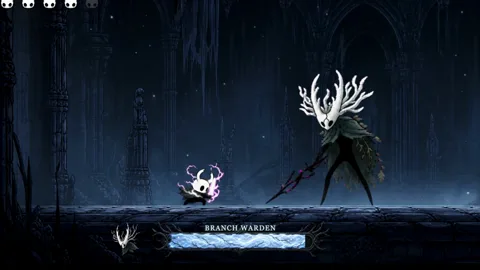</a> <strong>Hollow Knight boss slice</strong></td>
    <td width="33%" align="center" valign="top"><a href="https://vibegame.tettet.org/#demos">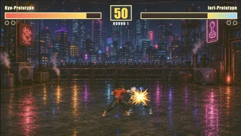</a> <strong>Arcade fighter</strong></td>
  </tr>
  <tr>
    <td width="33%" align="center" valign="top"><a href="https://vibegame.tettet.org/#demos">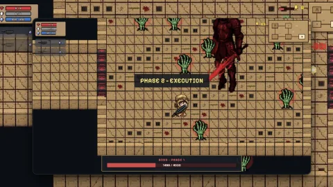</a> <strong>Dungeon roguelike</strong></td>
    <td width="33%" align="center" valign="top"><a href="https://vibegame.tettet.org/#demos">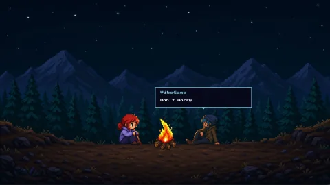</a> <strong>VibeGame Intro</strong></td>
    <td width="33%" align="center" valign="top"><a href="https://vibegame.tettet.org/#demos">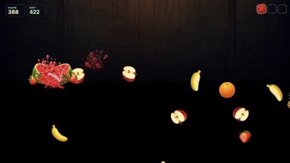</a> <strong>Fruit Ninja</strong></td>
  </tr>
  <tr>
    <td width="33%" align="center" valign="top"><a href="https://vibegame.tettet.org/#demos">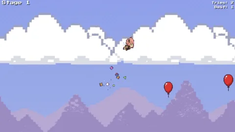</a> <strong>Aniya Parkour</strong></td>
    <td width="33%" align="center" valign="top"><a href="https://vibegame.tettet.org/#demos">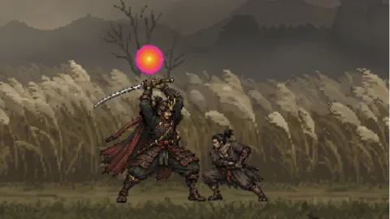</a> <strong>Pixel Sekiro</strong></td>
    <td width="33%" align="center" valign="top"><a href="https://vibegame.tettet.org/#demos">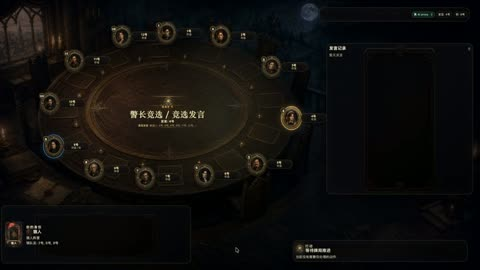</a> <strong>AI Werewolf party game</strong></td>
  </tr>
</table>

## VibeGame Dashboard

We provide a web dashboard for interacting more freely with the agent team and manually editing game properties.

<table>
  <tr>
    <td width="50%" align="center">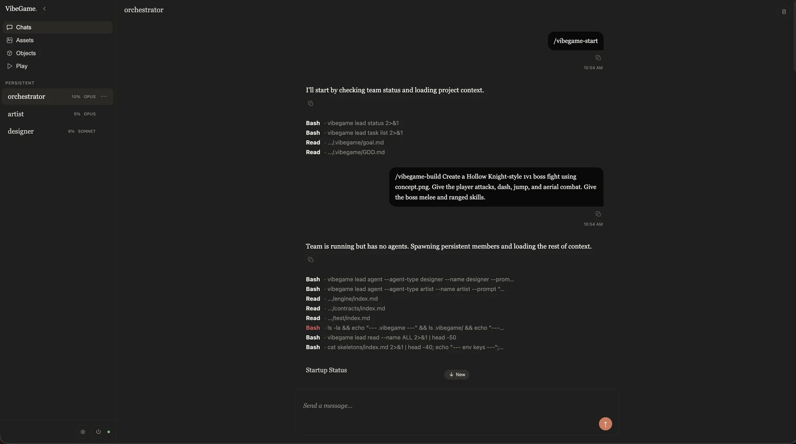 <strong>Chat</strong> Chat with your agents to start building</td>
    <td width="50%" align="center">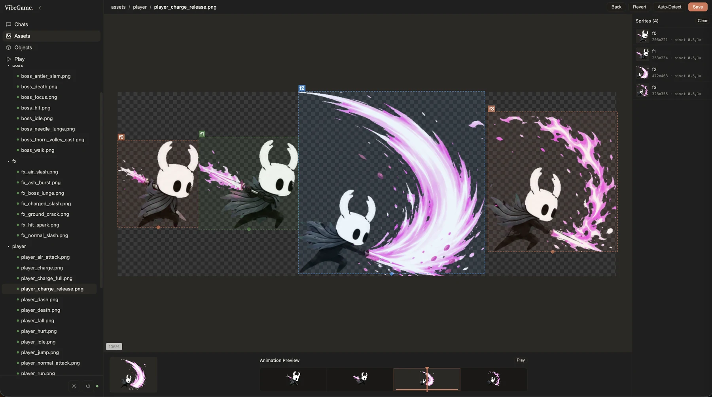 <strong>Assets</strong> Preview animations and adjust sprite bounds</td>
  </tr>
  <tr>
    <td width="50%" align="center">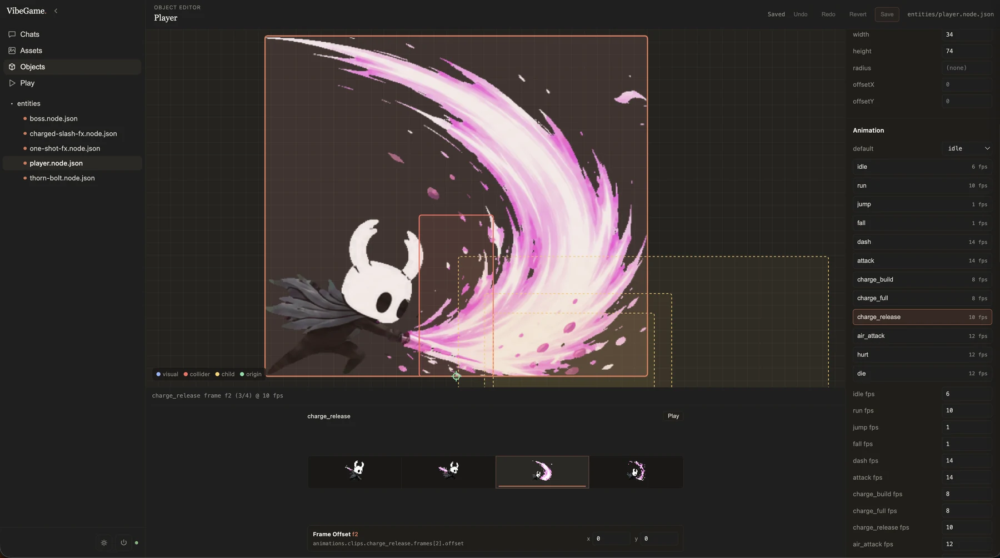 <strong>Objects</strong> Configure character animations and properties</td>
    <td width="50%" align="center">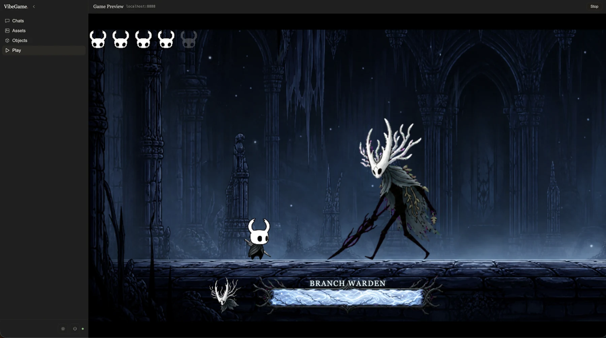 <strong>Play</strong> Play the game you are building</td>
  </tr>
</table>

## Roadmap

- [x] Release the VibeGame technical report
- [x] Open-source the Phaser-based VibeGame implementation
- [ ] Add Godot support
- [ ] Add Unity support
- [ ] Expand VibeGame from 2D to end-to-end 3D game creation

## Acknowledgments

We are inspired by the broader community exploring AI agents for game creation, game development, and gameplay. We thank the teams behind [GameDevBench](https://github.com/waynchi/gamedevbench), [OpenGame](https://github.com/leigest519/OpenGame), [GameCraft-Bench](https://github.com/FreedomIntelligence/gamecraft-bench), and other open-source projects for advancing this field and sharing their work with the community.

- [Claude Code](https://github.com/anthropics/claude-code) and [OpenAI Codex](https://github.com/openai/codex) - agent runtimes supported by VibeGame.
- [Phaser](https://github.com/phaserjs/phaser) - the web game framework beneath VibeGame's 2D engine.
- [Trellis](https://github.com/mindfold-ai/trellis) - inspiration for the design of VibeGame's development harness.
- [agent-sprite-forge](https://github.com/0x0funky/agent-sprite-forge) - inspiration for VibeGame's sprite-generation prompt design.

## License

VibeGame is released under the [Apache License 2.0](LICENSE).

### Commercial Deployment Notification

If you deploy VibeGame or a modified version as part of a commercial product or service, we kindly ask you to notify us at [kiyotakali075@gmail.com](mailto:kiyotakali075@gmail.com).

Please include the name of your organization, the product or service name, and a brief description of how VibeGame is being used. No confidential information is required.

This notification is requested for project tracking and community outreach purposes only. It does not require approval, impose a license fee, or modify any rights granted under the Apache License 2.0.
