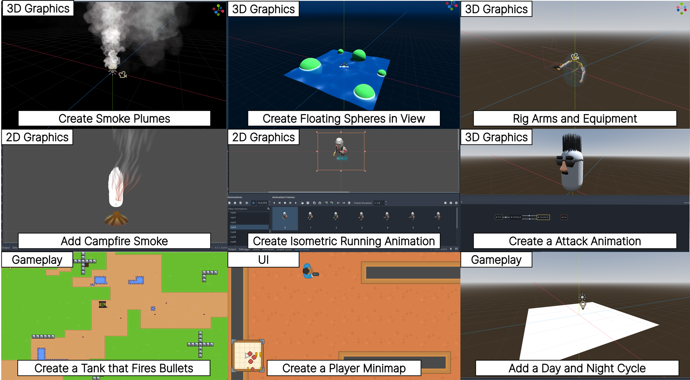
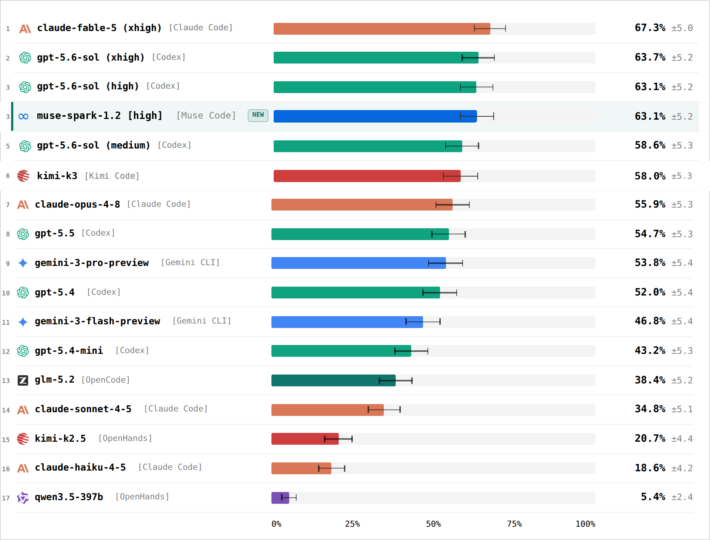
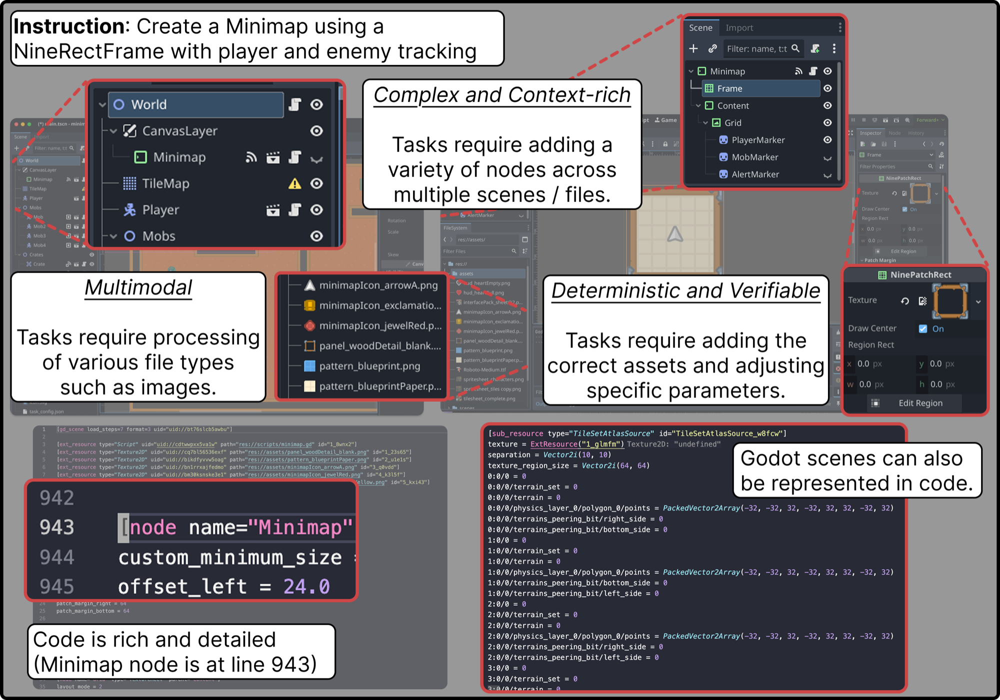

<div align="center">

<h1>GameDevBench</h1>
<h3>Evaluating Agentic Capabilities Through Game Development</h3>

**Wayne Chi, Yixiong Fang, Arnav Yayavaram, Siddharth Yayavaram, Seth Karten,<br>Qiuhong Anna Wei, Runkun Chen, Alexander Wang, Valerie Chen, Ameet Talwalkar, Chris Donahue**

*Carnegie Mellon University &nbsp;·&nbsp; Princeton University*

<br>

[](https://icml.cc/)
[](https://waynechi.com/gamedevbench)
[](https://arxiv.org/abs/2602.11103)
[](https://huggingface.co/papers/2602.11103)
[](https://godotengine.org/)
[](LICENSE)

<br>

*The first benchmark for evaluating LLM agents on game development tasks in a modern game engine &mdash; 333 tasks, published at ICML 2026.*

<strong><a href="https://waynechi.com/gamedevbench">Project website and full leaderboard</a></strong>

<br>



</div>

<br>

## Results

The official ICML 2026 camera-ready results are available in [`results/`](results/). Select the leaderboard to view the full results on the project website.

<p align="center">
  <a href="https://waynechi.com/gamedevbench#leaderboard">
    
  </a>
</p>

## Abstract

Despite rapid progress on coding agents, progress on their multimodal counterparts has lagged behind. A key challenge is the scarcity of evaluation testbeds that combine the complexity of software development with the need for deep multimodal understanding. Game development provides such a testbed as agents must navigate large, dense codebases while manipulating intrinsically multimodal assets such as shaders, sprites, and animations within a visual game scene.

We present **GameDevBench**, the first benchmark for evaluating agents on game development tasks. GameDevBench consists of 333 tasks derived from web and video tutorials. Tasks require significant multimodal understanding and are complex — the average solution requires over three times the lines of code and file changes compared to prior software development benchmarks. Agents struggle with game development, with the best agent and method solving only **63.7%** of tasks. We find a strong correlation between perceived task difficulty and multimodal complexity, with average success rate dropping from **51.4%** on gameplay-oriented tasks to **33.0%** on 2D graphics tasks.

To improve multimodal capability, we introduce two simple image and video-based feedback mechanisms for agents. Despite their simplicity, these methods consistently improve performance, increasing GPT-5.4's performance from **41.1%** to **52.0%** when given visual feedback. We release GameDevBench publicly to support further research into agentic game development.

## Overview

GameDevBench contains **333 game development tasks** to evaluate LLM agents' ability to complete game development problems in the **Godot game engine**. Tasks span four categories — **2D Graphics & Animation** (33.3%), **3D Graphics & Animation** (26.7%), **User Interface** (20.1%), and **Gameplay Logic** (19.8%) — and require agents to reason about multimodal assets including shaders, sprites, animations, and visual game scenes. On average, a reference solution edits **4.7 files** and **114 lines of code** across **3.2 distinct filetypes**.

<p align="center">
  
</p>

## Getting Started

### Prerequisites

- **Godot 4.x** — Download from [godotengine.org](https://godotengine.org/download). Ensure `godot` is in your PATH or set `GODOT_EXEC_PATH`.
- **Python 3.10+** (Python 3.12+ for OpenHands)

### Install an Agent

| Agent | Install Guide |
|-------|---------------|
| Claude Code | [code.claude.com](https://code.claude.com/docs/en/overview) |
| Codex | [openai.com/codex](https://openai.com/codex/) |
| Gemini CLI | [geminicli.com](https://geminicli.com/) |
| OpenCode | [opencode.ai](https://opencode.ai/docs/) |
| OpenHands | [openhands.dev](https://www.openhands.dev/) |

### Setup Tasks

```bash
bash unzip_tasks.sh
```

> Tasks are distributed as individual zip files to prevent accidental data leakage.

### Verify Your Setup

Every ground-truth solution should pass validation. To check your install (Godot, unzipped tasks) or the integrity of a release, run:

```bash
uv run python validate_tasks.py        # validates all 333 ground truths in parallel
```

### Configuration

You can use the built-in plans for `claude-code`, `codex`, and `gemini-cli`, or provide API keys directly. For OpenHands you must provide your own API keys. See [`.env.example`](.env.example) for details.

## Usage

```bash
uv run python gamedevbench/src/benchmark_runner.py \
  --agent AGENT \
  --model MODEL \
  run --task-list tasks.yaml
```

### Options

| Flag | Description |
|------|-------------|
| `--agent AGENT` | Agent to use *(required)* |
| `--model MODEL` | Model name (e.g., `claude-sonnet-4-5-20250929`; for OpenCode use `provider/model`) |
| `--effort EFFORT` | Provider-native reasoning effort for supported harnesses |
| `--enable-mcp` | Enable MCP screenshot capabilities *(macOS, or Linux with Xvfb and ffmpeg)* |
| `--use-runtime-video` | Append Godot runtime instructions to prompts |
| `--skip-display` | **Deprecated.** Retain the legacy behavior of skipping display-required tasks |
| `run --task-list FILE` | Task list YAML (e.g., `tasks.yaml`) |

When combining `--resume-from RESULTS.json` with `run --task-list FILE`, only
incomplete tasks named in the task list are rerun. Existing results outside the
selection are retained in the final summary.

### Platform Notes

On Linux, `run` and `validate` automatically start under Xvfb when `DISPLAY`
is unset, so display-required tasks run by default. Install the `xvfb` and
`xauth` OS packages in remote or container environments. `--skip-display` is
deprecated and will be removed in a future release.

MCP screenshot functionality uses AppleScript on macOS or Xvfb and ffmpeg on
Linux. Set `GODOT_SCREENSHOT_DISPLAY` to the correct display number when
selecting a macOS display.

### Reasoning Effort

Use `--effort <value>` to control reasoning effort for Claude Code, Codex,
OpenHands, and OpenCode. GameDevBench maps the value to the harness-native
setting:

- Claude Code: `ClaudeAgentOptions.effort`
- Codex: `model_reasoning_effort`
- OpenHands: `LLM.reasoning_effort`
- OpenCode: `--variant`

Accepted values depend on the provider and model; common values include `low`,
`medium`, `high`, and `xhigh`. When the flag is omitted, GameDevBench sends no
override and preserves the harness configuration or default. The requested
value is recorded in task, CSV, and aggregate result metadata.

## Citation

If you find GameDevBench useful, please cite our paper:

```bibtex
@misc{chi2026gamedevbenchevaluatingagenticcapabilities,
      title={GameDevBench: Evaluating Agentic Capabilities Through Game Development},
      author={Wayne Chi and Yixiong Fang and Arnav Yayavaram and Siddharth Yayavaram and Seth Karten and Qiuhong Anna Wei and Runkun Chen and Alexander Wang and Valerie Chen and Ameet Talwalkar and Chris Donahue},
      year={2026},
      eprint={2602.11103},
      archivePrefix={arXiv},
      primaryClass={cs.AI},
      url={https://arxiv.org/abs/2602.11103},
}
```

## License

This project is licensed under the [Apache License 2.0](LICENSE).
